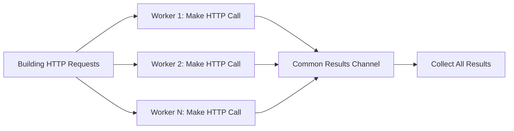

# Public Domain Audiobooks

### Aim & Purpose
The aim of this project is to develop a highly concurrent scrapper to download the entire database of [Librivox](https://librivox.org/) and write it to a relational database for educational purposes, which can also serve a ready-to-use database for software development projects. Please consider [donating](https://librivox.org/pages/how-to-donate/) to the Librivox organization to enable them to continue their amazing work.

---
### Architecture

The scrapper leverages the fan-out/fan-in concurrency pattern in Go, through using concurrency primitives such as goroutines, channels, and wait groups. The first stage of scrapping involves sending HTTP requests to a paginated jQuery service, to load the list of books and to parse the URL of individual books.

The second stage of the scrapping process involves hitting the URLs collected in the previous stage, to scrape the metadata of the audiobooks as well as the URL to their cover pictures and audio files.

Finally, the complete collected data is written to a postgres database.

---
### High Level Process Flow Diagram

---

### Roadmap
- Scrape audiobook URLs concurrently ✅
- Auto-retry on error ✅
- Scrape audiobook data ⏳
- Write to a postgres database ⏳
---

### License
This project is licensed under the [MIT License](LICENSE).